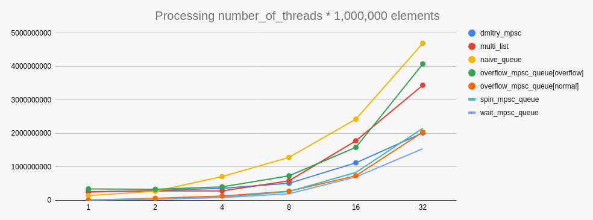

# zib

High performance Unbounded Multi-Producer Single-Consumer Queues for C++20.

The implementations are lock-less, wait-free and (yet to be proven formally) linearizable.

Contact: donald.rupin@pm.me

## Repository 

Queues are in self contained headers. Include one or both into your project.

## Using mpsc_zib

Requires gcc 11+

### Tests

Tests can be built:
```bash
mkdir build && cd build
cmake -GNinja -DCMAKE_BUILD_TYPE=Release ..
ninja
ctest
```

## Design 

These queues are built as a variation of [multilist mpsc queue](https://github.com/pramalhe/ConcurrencyFreaks/blob/master/papers/multilist-2017.pdf) by Andreia Coorreia and Pedro Remalhete. It includes some of the possible improvements listed in the paper, and some additional improvements for cache coherency and reduced system calls to allocate.

The first addition is that the queue operates on a linked list of `Node` arrays, rather then individual `Nodes`. This means that for each producer, the enqueue operation is similar to that of a ring buffer. Unlike a ring buffer, when the array reaches the end, a new one is allocated and linked. 

The second addition is that each writer also implements a Single-Producer Single-Consumer queue to "recycle" the `Node` arrays back to each respective producer. Once a consumer depletes a `Node` array, the memory is reset and pushed onto the SPSC queue. When a producer needs to allocate a new ring buffer, it checks to see if it can pull an array from the SPSC first.

The result of the design is that if the reader can somewhat keep up with the producers, a type of linked ring buffer mode can be achieved, where no new memory is allocated. In the worst case where the producers pull ahead, they can simply allocate more `Node` arrays. The SPSC is a bounded ring buffer, and if it is full, the `Node` arrays are de-allocated to prevent memory build up.

### Performance:

The repository contains a benchmark and some reference implementations to compare zib queues with others. The benchmark times the amount of time required to concurrently enqueue 1,000,000 elements per thread onto the queue, whilst the consumer attempts to dequeue all elements. The total time is the time it takes the consumer to successfully dequeue number_of_threads * 1,000,000 elements. 

Both zib queue variations where tested against:
- naive queue (std::dequeue and std::mutex)
- multilist by Andreia Coorreia and Pedro Remalhete
- [Dmitry Vyukov mpsc queue](https://www.1024cores.net/home/lock-free-algorithms/queues/non-intrusive-mpsc-node-based-queue) 

The following results were produced with `Intel i7-10875H (16 core)` Dell XPS. 

.

The `wait_mpsc_queue`is the fastest being 3x quicker then the simple mutex implementation, 2.3x quicker then multilist and 1.3 times quicker then dmitry's queue for the 32 threads benchmark. I would of guessed that the `spin_mpsc_queue` be the fastest - I am not sure why `wait_mpsc_queue` with the extra atomic operations and blocking is quicker. 

### Variations:

#### spin_mpsc_queue

The spin queue will never block but can return a `nullopt` if queue is empty.

#### wait_mpsc_queue

The wait queue will block when the queue is empty, and resume when the next element is enqueued. This requires an additional atomic variable and a couple of extra atomic operations. The block is achieved with the new `std::atomic::wait`. Although benchmarks indicate this queue is more performant for some reason. 

#### overflow_mpsc_queue

TODO:

A `wait_mpsc_queue` queue but with the property that the number of threads is not bounded. Thread id's over the allocated amount are allowed, but the elements added by the extra thread are not linearizable.


